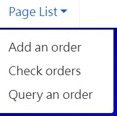
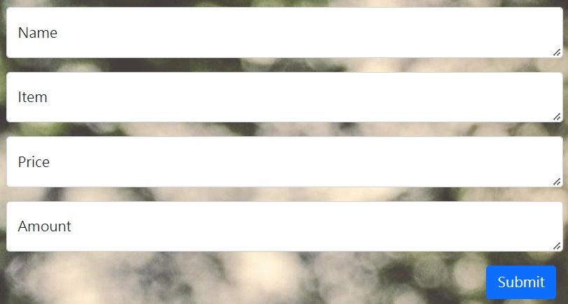
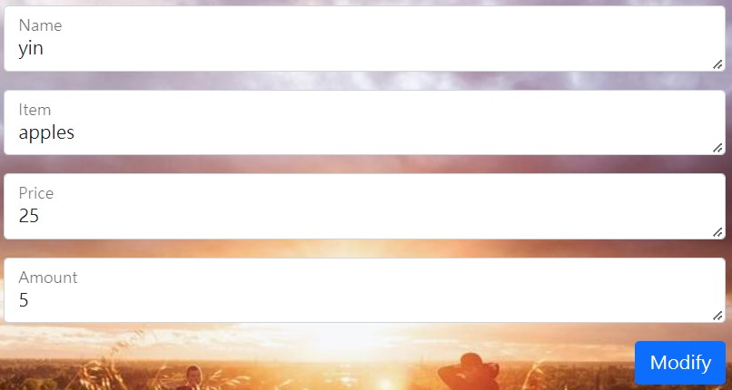
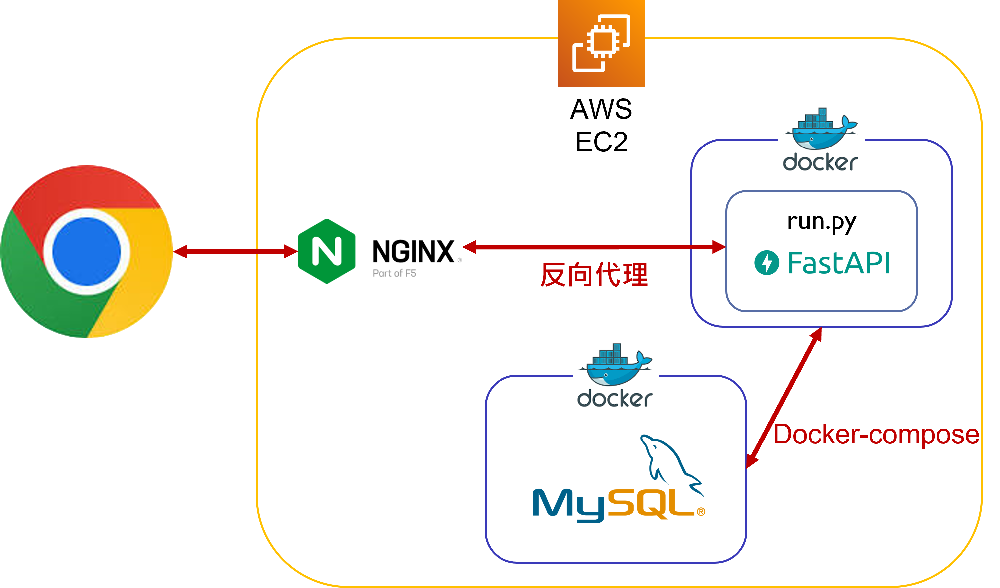

# Order Project 簡易訂單系統

## 網址
https://orders.yin888.info/

## 簡介
訂單系統可以新增、查詢及修改訂單。

## 功能
*  訪客
    *   列表選單（左上角）
     
    *   新增訂單（Add an oder）
     
    *   訂單總攬（Check oders）
     
      
* 點擊 Order_id 進入修改訂單頁面

    *   查詢訂單（Query an oder）
     
    *   修改訂單
     

## 網頁架構

## 使用工具
*   AWS
    *   EC2
     可擴展的運算容量，部署網頁應用程式。
*   Python
    *   uvicorn
     基於 asyncio 開發的一個輕量級高效的 web 伺服器框架。
    *   FastAPI
     開發網頁應用框架。
    *   HTMLResponse
     FastAPI 回應指定 html 模板的套件 。
    *   Jinja2Templates
     FastAPI 路由導至指定 html 模板的套件 。
    *   StaticFiles
     FastAPI 路由導至指定靜態檔案的套件 。
    *   pydantic
      type hints 為基礎做資料型態驗證的套件，以此套件定義 API 的請求及回應格式（Order_Model）。
    *   asyncio
     Python 的非同步處理模組，藉由 await 等待過程切換至 Event loop 執行其他 Tasks 。
    *   dotenv
     取用.env的資訊，避免洩漏私密資訊。
    *   sqlAlchemy
     Python 的 ORM 套件，可以避免 SQL Injection。
*   JavaScript
    *   Bootstrap
      HTML 的 Dom 建立及排版。
    *   AJAX
      Asynchronous JavaScript and XML，處理對 Server's API 的非同步請求。
*   Others
    *   Docker
     輕量級的虛擬化技術，跨平台部屬專案，此專案使用 dcoker-compose 將 Web app 與 MySQL 同時部署至 EC2。
    *   nginx
     網頁伺服器，此專案應用其反向代理 ( Reverse Proxy ) 的功能。
    *   git
     版本控管工具。
## 問題解決
### 發生問題：500 Internal Server Error
### 尋找真因：
- [X] 使用 DockerCompose 啟動 Web App 及 MySQL 時，各功能運作正常
    *   各功能測試並使用 docker log 檢查執行狀況皆無異常，排除 Web app 及 MySQL 各別運作問題。
- [X] 相隔一段時間再度發生 500 Internal Server Error 問題
    *   使用 docker ps 檢查各 Container 皆運作正常並無 Container 被停止的狀況。
    *   網頁開啟正常，但無法新增訂單及查看訂單 → web app 運作正常，推測為資料庫異常。
    *   使用 docker exec 進入 MySQL container 並執行簡單指令 SELECT * FROM <\table> 確認 MySQL 運作正常 → MySQL 運作正常。
    *   暫停 MySQL 再重啟 MySQL 後一樣顯示 500 Internal Server Error → 資料庫不是異常的真因。
    *   暫停 Web app 再重啟 Web app 後各功能運作正常，並且資料庫的資料並未被重置 → 資料庫運作正常並且 web app 正常，推測為資料庫 timeout 設定問題。
- [X] 檢查 Web app 的 log，log 顯示 MySQL server has gone away
    *   確定為資料庫 timeout 設定問題。
    *   連線閒置導致 MySQL 關閉連線，MySQL 預設的 interactive_timeout 及 wait_timeout 時間為8小時。（https://dev.mysql.com/doc/refman/8.0/en/server-system-variables.html ）
### 真因：連線閒置導致 MySQL 關閉連線
### 解決方案：
- [ ] 設定 MySQL 的 interactive_timeout。
    *   如 MySQL 閒置時間超出 interactive_timeout 延長時間仍然會斷線導致伺服器錯誤，治標不治本。
- [ ] Web app 定時向 MySQL 請求連線。
    *   定時向 MySQL 送出一個 SELECT 1 的無意義請求浪費資源，治標不治本。
- [X] SQLAlchemy 於 create_engine 設定 pool_recycle=3600，設定連線時間超過 1 小時即回收連線；由於每小時會回收連線的動作，所以會與 MySQL 通訊，使 MySQL 不會閒置 8 小時。
