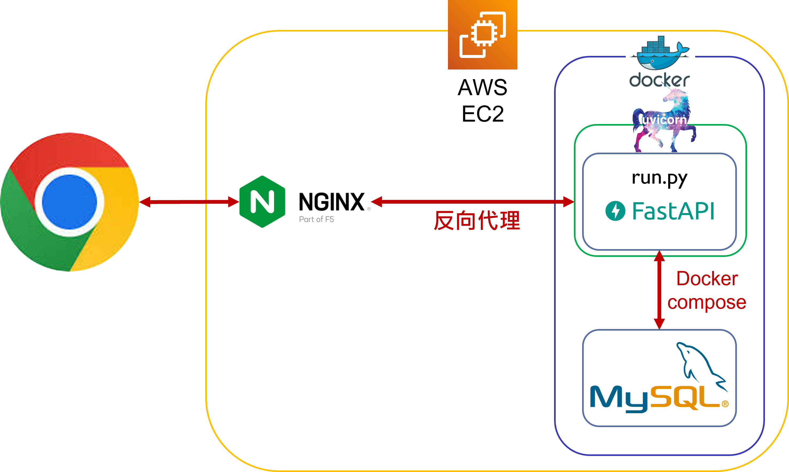

# Order Project 簡易訂單系統

## 網址
https://orders.yin888.info/

## 簡介
訂單系統可以新增、查詢及修改訂單。

## 功能
*  訪客
    *   列表選單（左上角）
     
    *   新增訂單（Add an oder）
     
    *   訂單總攬（Check oders）
     
      
* 點擊 Order_id 進入修改訂單頁面

    *   查詢訂單（Query an oder）
     
    *   修改訂單
     

## 網頁架構

## 使用工具
*   AWS
    *   EC2
     可擴展的運算容量，部署網頁應用程式。
*   Python
    *   uvicorn
     基於 asyncio 開發的一個輕量級高效的 web 伺服器框架。
    *   FastAPI
     開發網頁應用框架。
    *   HTMLResponse
     FastAPI 回應指定 html 模板的套件 。
    *   Jinja2Templates
     FastAPI 路由導至指定 html 模板的套件 。
    *   StaticFiles
     FastAPI 路由導至指定靜態檔案的套件 。
    *   pydantic
      type hints 為基礎做資料型態驗證的套件，以此套件定義 API 的請求及回應格式（Order_Model）。
    *   asyncio
     Python 的非同步處理模組，藉由 await 等待過程切換至 Event loop 執行其他 Tasks 。
    *   dotenv
     取用.env的資訊，避免洩漏私密資訊。
    *   sqlAlchemy
     Python 的 ORM 套件，可以避免 SQL Injection。
*   JavaScript
    *   Bootstrap
      HTML 的 Dom 建立及排版。
    *   AJAX
      Asynchronous JavaScript and XML，處理對 Server's API 的非同步請求。
*   Others
    *   Docker
     輕量級的虛擬化技術，跨平台部屬專案，此專案使用 dcoker-compose 將 Web app 與 MySQL 同時部署至 EC2。
    *   nginx
     網頁伺服器，此專案應用其反向代理 ( Reverse Proxy ) 的功能。
    *   git
     版本控管工具。